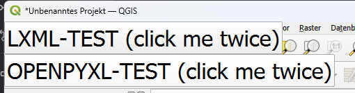
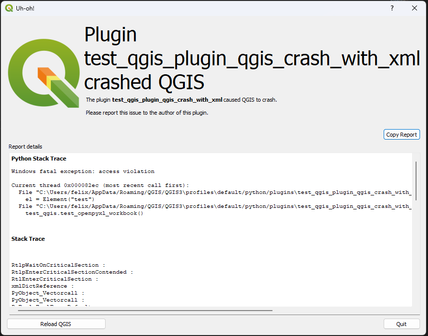
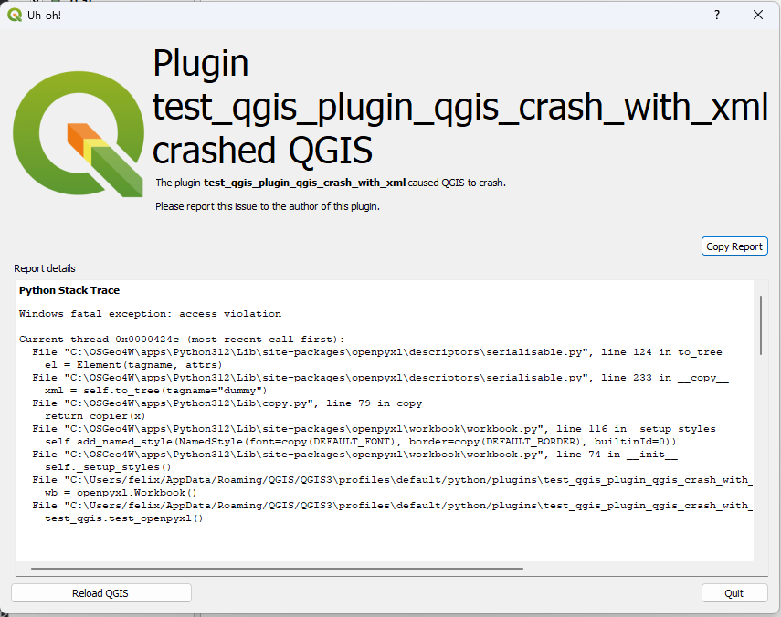

# Test Plugin
Lets QGIS crash when creating/using openpyxl (lxml)

# What does it?
A pre-condition: Open a GeoPackage and add a layer to the current QGIS project instance (e.g. drag&drop or using Python code)

1. Read a GeoPackage layer into the current QGIS project instance
2. try to create an empty openpyxl Workbook or use the `Element` from `lxml.etree`
3. (repeat it)

### Solution
Replace lxml 5.2.1 with 5.2.2.
The detailed reason for the crash is unknown for me, no further checks.

### Plugin installed? Press a button (twice)



#### After pressing the LXML button twice you will see


```
Python Stack Trace
Windows fatal exception: access violation

Current thread 0x00007f30 (most recent call first):
  File "C:\Users/felix/AppData/Roaming/QGIS/QGIS3\profiles\default/python/plugins\test_qgis_plugin_qgis_crash_with_xml\tests\test_qgis.py", line 17 in test_openpyxl_workbook
    el = Element("test")
  File "C:\Users/felix/AppData/Roaming/QGIS/QGIS3\profiles\default/python/plugins\test_qgis_plugin_qgis_crash_with_xml\__init__.py", line 56 in run
    test_qgis.test_openpyxl_workbook()


Stack Trace


RtlpWaitOnCriticalSection :
RtlpEnterCriticalSectionContended :
RtlEnterCriticalSection :
xmlDictReference :
PyObject_Vectorcall :
PyObject_Vectorcall :
PyEval_EvalFrameDefault :
PyFunction_Vectorcall :
Py_hashtable_compare_direct :
PyObject_Call :
PyObject_Call :
PyInit_QtCore :
PyInit_QtCore :
PyInit_QtCore :
PyInit_QtCore :
QObject::qt_static_metacall :
QAbstractButton::clicked :
QAbstractButton::click :
QAbstractButton::mouseReleaseEvent :
PyInit_QtWidgets :
QWidget::event :
PyInit_QtWidgets :
QApplicationPrivate::notify_helper :
QApplication::notify :
QgsApplication::notify qgsapplication.cpp:601
QCoreApplication::notifyInternal2 :
QApplicationPrivate::sendMouseEvent :
QSizePolicy::QSizePolicy :
QSizePolicy::QSizePolicy :
QApplicationPrivate::notify_helper :
QApplication::notify :
QgsApplication::notify qgsapplication.cpp:601
QCoreApplication::notifyInternal2 :
QGuiApplicationPrivate::processMouseEvent :
QWindowSystemInterface::sendWindowSystemEvents :
QEventDispatcherWin32::processEvents :
qt_plugin_query_metadata :
QEventLoop::exec :
QCoreApplication::exec :
main main.cpp:1830
BaseThreadInitThunk :
RtlUserThreadStart :


QGIS Info
QGIS Version: 3.34.8-Prizren
QGIS code revision: 91642333
Compiled against Qt: 5.15.13
Running against Qt: 5.15.13
Compiled against GDAL: 3.9.0
Running against GDAL: 3.9.1


System Info
CPU Type: x86_64
Kernel Type: winnt
Kernel Version: 10.0.22631

```

#### After pressing the OPENPYXL button twice


```
Python Stack Trace
Windows fatal exception: access violation

Current thread 0x0000424c (most recent call first):
  File "C:\OSGeo4W\apps\Python312\Lib\site-packages\openpyxl\descriptors\serialisable.py", line 124 in to_tree
    el = Element(tagname, attrs)
  File "C:\OSGeo4W\apps\Python312\Lib\site-packages\openpyxl\descriptors\serialisable.py", line 233 in __copy__
    xml = self.to_tree(tagname="dummy")
  File "C:\OSGeo4W\apps\Python312\Lib\copy.py", line 79 in copy
    return copier(x)
  File "C:\OSGeo4W\apps\Python312\Lib\site-packages\openpyxl\workbook\workbook.py", line 116 in _setup_styles
    self.add_named_style(NamedStyle(font=copy(DEFAULT_FONT), border=copy(DEFAULT_BORDER), builtinId=0))
  File "C:\OSGeo4W\apps\Python312\Lib\site-packages\openpyxl\workbook\workbook.py", line 74 in __init__
    self._setup_styles()
  File "C:\Users/felix/AppData/Roaming/QGIS/QGIS3\profiles\default/python/plugins\test_qgis_plugin_qgis_crash_with_xml\tests\test_qgis.py", line 30 in test_openpyxl
    wb = openpyxl.Workbook()
  File "C:\Users/felix/AppData/Roaming/QGIS/QGIS3\profiles\default/python/plugins\test_qgis_plugin_qgis_crash_with_xml\__init__.py", line 69 in run_openpyxl
    test_qgis.test_openpyxl()


Stack Trace


RtlpWaitOnCriticalSection :
RtlpEnterCriticalSectionContended :
RtlEnterCriticalSection :
xmlDictReference :
PyObject_Vectorcall :
PyObject_Vectorcall :
PyEval_EvalFrameDefault :
PyFunction_Vectorcall :
PyObject_Call_Prepend :
PyObject_Vectorcall :
PyObject_Vectorcall :
PyEval_EvalFrameDefault :
PyFunction_Vectorcall :
Py_hashtable_compare_direct :
PyObject_Call :
PyObject_Call :
PyInit_QtCore :
PyInit_QtCore :
PyInit_QtCore :
PyInit_QtCore :
QObject::qt_static_metacall :
QAbstractButton::clicked :
QAbstractButton::click :
QAbstractButton::mouseReleaseEvent :
PyInit_QtWidgets :
QWidget::event :
PyInit_QtWidgets :
QApplicationPrivate::notify_helper :
QApplication::notify :
QgsApplication::notify qgsapplication.cpp:601
QCoreApplication::notifyInternal2 :
QApplicationPrivate::sendMouseEvent :
QSizePolicy::QSizePolicy :
QSizePolicy::QSizePolicy :
QApplicationPrivate::notify_helper :
QApplication::notify :
QgsApplication::notify qgsapplication.cpp:601
QCoreApplication::notifyInternal2 :
QGuiApplicationPrivate::processMouseEvent :
QWindowSystemInterface::sendWindowSystemEvents :
QEventDispatcherWin32::processEvents :
qt_plugin_query_metadata :
QEventLoop::exec :
QCoreApplication::exec :
main main.cpp:1830
BaseThreadInitThunk :
RtlUserThreadStart :


QGIS Info
QGIS Version: 3.34.8-Prizren
QGIS code revision: 91642333
Compiled against Qt: 5.15.13
Running against Qt: 5.15.13
Compiled against GDAL: 3.9.0
Running against GDAL: 3.9.1


System Info
CPU Type: x86_64
Kernel Type: winnt
Kernel Version: 10.0.22631

```

#### QGIS 3.38
```
Python Stack Trace
Windows fatal exception: access violation

Current thread 0x00006e5c (most recent call first):
  File "C:\Users/felix/AppData/Roaming/QGIS/QGIS3\profiles\default/python/plugins\test_qgis_plugin_qgis_crash_with_xml\tests\test_qgis.py", line 17 in test_lxml
    el = Element("test")
  File "C:\Users/felix/AppData/Roaming/QGIS/QGIS3\profiles\default/python/plugins\test_qgis_plugin_qgis_crash_with_xml\__init__.py", line 63 in run_lxml
    test_qgis.test_lxml()


Stack Trace


RtlpWaitOnCriticalSection :
RtlpEnterCriticalSectionContended :
RtlEnterCriticalSection :
xmlDictReference :
PyObject_Vectorcall :
PyObject_Vectorcall :
PyEval_EvalFrameDefault :
PyFunction_Vectorcall :
Py_hashtable_compare_direct :
PyObject_Call :
PyObject_Call :
PyInit_QtCore :
PyInit_QtCore :
PyInit_QtCore :
PyInit_QtCore :
QObject::qt_static_metacall :
QAbstractButton::clicked :
QAbstractButton::click :
QAbstractButton::mouseReleaseEvent :
PyInit_QtWidgets :
QWidget::event :
PyInit_QtWidgets :
QApplicationPrivate::notify_helper :
QApplication::notify :
QgsApplication::notify :
QCoreApplication::notifyInternal2 :
QApplicationPrivate::sendMouseEvent :
QSizePolicy::QSizePolicy :
QSizePolicy::QSizePolicy :
QApplicationPrivate::notify_helper :
QApplication::notify :
QgsApplication::notify :
QCoreApplication::notifyInternal2 :
QGuiApplicationPrivate::processMouseEvent :
QWindowSystemInterface::sendWindowSystemEvents :
QEventDispatcherWin32::processEvents :
qt_plugin_query_metadata :
QEventLoop::exec :
QCoreApplication::exec :
main :
BaseThreadInitThunk :
RtlUserThreadStart :


QGIS Info
QGIS Version: 3.38.0-Grenoble
QGIS code revision: 37aa6188bc
Compiled against Qt: 5.15.13
Running against Qt: 5.15.13
Compiled against GDAL: 3.9.0
Running against GDAL: 3.9.0


System Info
CPU Type: x86_64
Kernel Type: winnt
Kernel Version: 10.0.22631
```

### uh-oh `el = Element("test")` from the `lxml` package